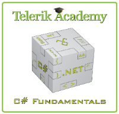
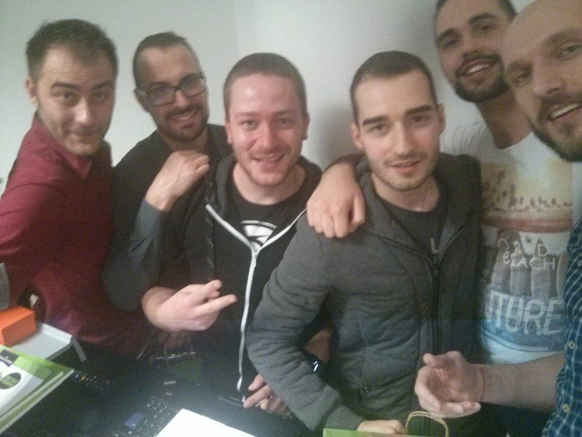
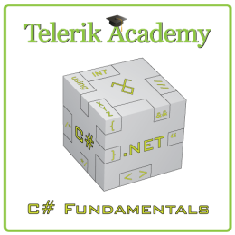
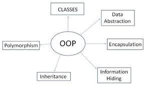

<!-- section start -->
<!-- attr: { class:'slide-title', showInPresentation:true, hasScriptWrapper:true } -->
# Object-OrientedProgramming: Course Intro
## OOP Course Program, Evaluation, Exams, Resources
<!--  -->
<!--  -->
<!--  -->

	
C# OOP

	
Telerik Software Academy

	<a href="https://telerikacademy.com" class="signature-link">https://telerikacademy.com</a>

<!-- section start -->
<!-- attr: { showInPresentation:true, hasScriptWrapper:true } -->
# Table of Contents
- [What's Coming Next in the Academy?](#next)
- [The OOP Course Program](#program)
- [Exams and Evaluation](#evaluate)
  - [Standard Criteria](#criteria)
  - [Bonuses](#bonuses)
- [Resources for the Course](#resources)

<!--  -->

<!-- section start -->
<!-- attr: { class:'slide-section', showInPresentation:true, hasScriptWrapper:true } -->
<!-- # Object-Oriented Programming (OOP) -->
## Coming To The Next Module

<!--  -->

<!-- attr: { showInPresentation:true, hasScriptWrapper:true } -->
# What's Coming Next?
- Object-Oriented Programming (OOP)
  - Continuation of C# – Part II
  - Fundamentals of OOP
- Pretty much the same
  - Lectures two times a week
  - Practical exam after a month
- The course exam?
  - 2 problems for 6 hours
  - http://bgcoder.com and Trainers

<!--  -->

<!-- attr: { showInPresentation:true, hasScriptWrapper:false } -->
# C# Track Objectives
- The **C# Programming**track at the Academy:
  - Give the trainees the **fundamental** computer programming knowledge and skills
  - Establish the logical and **algorithmic thinking**
    - Development of **problems solving**skills
  - Learn basic **data structures**, **algorithms** and object-oriented programming (**OOP**) concepts
  - Learn to produce **high-quality code**
  - **Prepare** for learning the software technologies
    - HTML5, DB & SQL, Cloud, Web, Mobile, QA, …

<!-- section start -->
<!-- attr: { class:'slide-section', showInPresentation:true, hasScriptWrapper:true } -->
# OOP – Program
## What Will We Cover in the OOP Course?

<!--  -->

<!-- attr: { showInPresentation:true, hasScriptWrapper:true } -->
# The OOP Course Program
- OOP Course Intro
  - Course Program, Exams, Evaluation
- Defining Classes – Part 1
  - Classes, Fields, Constructors, Methods,  Properties, Enums
- Defining Classes – Part 2
  - Static Members, Structures, Generic Types, Namespaces, Attributes
- Delegates, Extension Methods, Lambda Functions, Anonymous Types and LINQ

<!--  -->
    <!--  -->
<!--  -->

<!-- attr: { showInPresentation:true, hasScriptWrapper:true } -->
<!-- # The OOP Course Program -->
- OOP Fundamental Principles – Part 1
  - Inheritance, Abstraction, Encapsulation
- OOP Fundamental Principles – Part 2
  - Polymorphism, Real-World Class Hierarchies, Cohesion and Coupling, UML Class Diagrams
- .NET Common Type System
  - Value and Reference Types, SystemInterfaces, Cloning, Comparison, Enumeration
- OOP Workshop
- Exam Preparation

<!--  -->
<!--  -->
<!--  -->

<!-- section start -->
<!-- attr: { class:'slide-section', showInPresentation:true, hasScriptWrapper:true } -->
# Trainers Team

<!--  -->
<!--  -->
<!--  -->
<!--  -->
<!--  -->

<!-- attr: { showInPresentation:true, hasScriptWrapper:true } -->
# Trainers Team
- **Nikolay Kostov**
  - Manager Software Engineering@  Telerik (Progress)
  - Microsoft Certified Trainer (MCT)
  - Champion from Telerik Academy
  - IT and Informatics competitions winner
  - Student in Sofia University (Computer Science)
  - Email: nikolay.kostov [at] telerik.com
  - Blog: http://nikolay.it
  - GitHub: https://github.com/NikolayIT

<!--  -->

<!-- attr: { showInPresentation:true, hasScriptWrapper:true } -->
# Trainers Team
- **Doncho Minkov**
  - Senior Technical Trainer@ Telerik Software Academy
  - Contestant in the Informatics competitions
  - Champion from Telerik Software Academy
  - Experience with Web and Mobile apps
  - Proficient with JavaScript and .NET
  - Email: doncho.minkov [at] telerik.com
  - Blog: http://minkov.it

<!--  -->

<!-- attr: { showInPresentation:true, hasScriptWrapper:true } -->
<!-- # Trainers Team -->
- **Ivaylo Kenov**
  - Technical Trainer @ Telerik Academy
  - Mathematical competitions contestant
  - Champion from Telerik Software Academy
  - E-mail: ivaylo.kenov [at] telerik.com
  - Champion in OOP and DSA
  - Blog: http://ivaylo.bgcoder.com/
  - GitHub: https://github.com/ivaylokenov

<!--  -->

<!-- attr: { showInPresentation:true, hasScriptWrapper:true } -->
<!-- # Trainers Team -->
- **Evlogi Hristov**
  - Technical Trainer@ Telerik Academy
  - Graduate from the fourth season of Telerik Software Academy
  - Ex-developer, Sharepoint
  - E-mail: evlogi.hristov [at] telerik.com

<!--  -->

<!-- attr: { showInPresentation:true, hasScriptWrapper:true } -->
<!-- # Trainers Team -->
- **Konstantin Simeonov**
  - Technical Trainer@ Telerik Academy
  - Graduate from the sixth season  of Telerik Software Academy
  - E-mail: konstantin.simeonov [at] telerik.com
  - GitHub: https://github.com/KonstantinSimeonov

<!--  -->

<!-- attr: { showInPresentation:true, hasScriptWrapper:true } -->
<!-- # Trainers Team -->
- **Martin Vesheff**
  - Technical Trainer@ Telerik Academy
  - Graduate from the sixth season  of Telerik Software Academy
  - E-mail: martin.vesheff [at] telerik.com
  - GitHub: https://github.com/vesheff
<!--  -->

<!-- attr: { showInPresentation:true, hasScriptWrapper:true } -->
<!-- # Trainers Team -->
- **Kristiyan Tsuklev**
    - Technical Trainer @ Telerik Academy
    - Champion in national and international  Informatics competitions
    - Student in Sofia University (Computer Science)
    - E-mail: kristian.tsuklev [at] telerik.com
    - GitHub: https://github.com/cuklev
<!--  -->

<!-- section start -->
<!-- attr: { class:'slide-section', showInPresentation:true, hasScriptWrapper:true } -->
# Evaluation
## Thank God There Are Bonuses!
<!--  -->
<!--  -->
<!--  -->

<!-- attr: { showInPresentation:true, hasScriptWrapper:true } -->
# OOP – Evaluation
- Evaluation components
  - **Practical exam** – **65%**
    - Half correctness, half OOP
  - **Team work**– **10%**
  - **Homework** – **10%**
  - Homework **evaluation**– **5%**
    - 3 peer reviews per homework
  - **Attendance** in class – **10%**
- **Forums** **activity** – bonus up to **5%**
- **Helping** the **other** students – bonus up to **10%**
<!--  -->
<!--  -->

<!-- attr: { showInPresentation:true, hasScriptWrapper:false } -->
# OOP Exams
- **PracticalProgramming Exam**
  - 2 practical problems for 6 hours
  - Covers all learned topics up to the moment
  - Automated judge system & real-time feedback
    - http://bgcoder.com
      - You can practice all previous OOP exams(more than 50 problems)
  - Solutions are evaluated for correctness (by BGCoder) and OOP (by the Trainers)
  - Use the same email address in both systems!

<!-- attr: { showInPresentation:true, hasScriptWrapper:false } -->
# Homework Peer Reviews
- Everyone will **get feedback** for their homework
- Everyone will **give feedback** for few random homework submissions
  - Students submit homework **anonymously**
    - Please exclude your name from the submissions!
  - For each homework submitted
    - Students **evaluate 3 random homeworks**
    - From the same topic, after the deadline
    - Give written feedback, at least 200 characters
    - Low-quality feedback &rarr; report for punishment

<!-- attr: { showInPresentation:true, hasScriptWrapper:true } -->
# Attendance in Class
  - We encourage live participation
  - **Top performers through out the years have always spent lots of time in the academy halls**
- Register your presence @ barcode scanners
  - Last check-in is listed in your student profile
  - Scanners are next to the doors
  - Use Student ID Card
  - Check in +/-30 min.  before/after lecture starts
  <!--  -->

<!-- attr: { showInPresentation:true, hasScriptWrapper:true } -->
# Pass / Excellence / Fail Criteria
  - Criteria for pass / pass with excellence / fail
    - **Passwith excellence**
    - Very high exam results
    - 	  or
    - High total results
  - **Pass**
    - Average total results
  - **Fail**
    - Low total results or low exam results

<!--  -->
<!--  -->
<!--  -->

<!-- attr: { showInPresentation:true, hasScriptWrapper:false } -->
# Homework Assignments
- Doing your homework is very important!
  - Programming can only belearned through **a lot of practice**!
- After each lecture there are a few exercises
  - Try to solve them in class
  - The rest are your homework
- Homework assignments due 1 week after each lecture – no excuses for being late
  - Deadlines are final & enforced by the system
- Submit homework through telerikacademy.com

<!-- section start -->
<!-- attr: { class:'slide-section', showInPresentation:true, hasScriptWrapper:true } -->
# Resources
## What We Need in Addition to this Course Content?

<!--  -->
<!--  -->
<!--  -->
<!--  -->
<!--  -->
<!--  -->
<!--  -->
<!--  -->

<!-- attr: { showInPresentation:true, hasScriptWrapper:true } -->
# The C# Textbook
- The **official textbook** for the course
  - “Introduction to Programming with C#”, Nakov S. and his team, 2010
  - Freely downloadable from: www.introprogramming.info
- The C# programming tracks follows the book
- OOP &rarr; chapters 11, 14, 20 and 22

<!--  -->

<!-- attr: { showInPresentation:true, hasScriptWrapper:true } -->
# Course Web Site & Forums
- Register for the "Telerik Academy Forums":
  - Discuss the course exercises with your colleagues
  - Find solutions for the exercises
  - Share source code / discuss ideas
- The OOP official web site:
- telerikacademy.com/Forum/Category/16/csharp-oop
- http://academy.telerik.com/student-courses/programming/object-oriented-programming/

<!--  -->

<!-- attr: { showInPresentation:true, hasScriptWrapper:true } -->
<!-- # Telerik IntegratedLearning System (TI -->
- The Telerik Integrated Learning System (TILS)
  - www.telerikacademy.com
  - Important resource for all students
  - Homework submissions
  - Homework peer reviews
  - Presence cards with barcode
  - Reports about your results
- telerikacademy.com/Courses/Courses/Details/225

<!--  -->

<!-- attr: { showInPresentation:true, hasScriptWrapper:true } -->
# Required Software
- Software needed for this course:
  - Microsoft Windows (XP / Win7 / Win8)
  - Microsoft **Visual Studio2013** or Visual Studio Community 2013 (free version of  VS 2013)
    - Visual Studio 2012, 2015 is also OK
    - Other IDEs (e.g. MonoDevelop) are OK, too
  - .NET Framework 4.5 (included in Visual Studio)

<!--  -->
<!--  -->

<!-- attr: { class:'slide-section', showInPresentation:true, hasScriptWrapper:true } -->
# Object-Oriented Programming: Course Introduction
## Questions?

<!--  -->
<!--  -->
<!--  -->
<!--  -->

<!-- attr: { showInPresentation:true, hasScriptWrapper:true } -->
# Free Trainings @ Telerik Academy
- C# Programming @ Telerik Academy
    - [C# OOP Course](http://academy.telerik.com/student-courses/programming/object-oriented-programming/about)
  - Telerik Software Academy
    - [telerikacademy.com](https://telerikacademy.com)
  - Telerik Academy @ Facebook
    - [facebook.com/TelerikAcademy](facebook.com/TelerikAcademy)
  - Telerik Software Academy Forums
    - [forums.academy.telerik.com](forums.academy.telerik.com)

<!--  -->
<!--  -->
<!--  -->
<!--  -->
