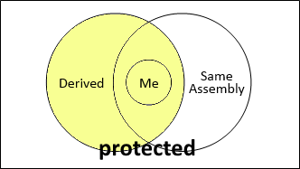

<!-- section start -->
<!-- attr: { class:'slide-title', showInPresentation:true, hasScriptWrapper:true } -->
# Defining Classes – Part 1
## Classes, Fields, Constructors, Methods, Properties


<!--  -->
<div class="signature">
	<p class="signature-course">C# OOP</p>
	<p class="signature-initiative">Telerik Software Academy</p>
	<a href="https://telerikacademy.com" class="signature-link">https://telerikacademy.com</a>
</div>


<!-- section start -->
<!-- attr: { showInPresentation:true, hasScriptWrapper:true } -->
# Table of Contents
- [Defining Simple Classes](#classes)
- [Fields](#fields)
- [Access Modifiers](#modifiers)
- [Using Classes and Objects](#using)
- [Constructors](#constructors)
- [Methods](#methods)
- [Properties](#property)
- [Enumerations (Enums)](#enumerations)
- [Keeping the Object State](#objectstate)


<!--  -->
<!--  -->


<!-- section start -->
<!-- attr: { class:'slide-section', showInPresentation:true, hasScriptWrapper:true } -->
<!-- # Defining Simple Classes -->


<!--  -->


<!-- attr: { showInPresentation:true, hasScriptWrapper:false } -->
# Classes in OOP
- **Classes** model real-world objects and define
  - **Attributes** (state, properties, fields)
  - **Behavior** (methods, operations)
- Classes describe the structure of objects
  - Objects describe particular instance of a class
- Properties hold information about the modeled object relevant to the problem
- Operations implement object behavior


<!-- attr: { showInPresentation:true, hasScriptWrapper:false } -->
# Classes in **C#**
- Classes in C# can have **members**:
  - Fields, constants, methods, properties, indexers, events, operators, constructors, destructors, …
  - Inner types (inner classes, structures, interfaces, delegates, ...)
- Members can have access modifiers (scope)
  - **public**, **private**, **protected**, **internal**
- Members can be
  - **static** (common) or **instance** (specific for a given object)


<!-- attr: { showInPresentation:true, hasScriptWrapper:true } -->
# Simple Class Definition

```cs
public class Cat : Animal {
   private string name;
   private string owner;

   public Cat(string name, string owner)
   {
      this.name = name;
      this.owner = owner;
   }

   public string Name
   {
      get { return this.name; }
      set { this.name = value; }
   }
```

<div class="fragment balloon" style="top:25%; left:58.31%; width:17.50%">Fields</div>
<div class="fragment balloon" style="top:41%; left:50.82%; width:25.00%">Constructor</div>
<div class="fragment balloon" style="top:58.01%; left:56.66%; width:19.16%">Property</div>
<div class="fragment balloon" style="top:10.36%; left:20.28%; width:51.13%">Begin of class definition</div>
<div class="fragment balloon" style="top:15%; left:44%; width:40.55%">Inherited (base) class</div>


<!-- attr: { showInPresentation:true, hasScriptWrapper:true } -->
<!-- # Simple Class Definition -->

```cs
   public string Owner
   {
      get { return this.owner; }
      set { this.owner = value; }
   }

   public void SayMiau()
   {
      Console.WriteLine("Miauuuuuuu!");
   }
}
```

<div class="fragment balloon" style="top:41%; left:41%; width:19.28%">Method</div>
<div class="fragment balloon" style="top:61.27%; left:12.34%; width:24.15%">End of class definition</div>
<!--  -->


<!-- attr: { showInPresentation:true, hasScriptWrapper:true, style:'font-size:0.9em;' } -->
# Class Definition and Members
- **Class definition** consists of:
  - Class declaration
  - Inherited class or implemented interfaces
  - Fields (static or not)
  - Constructors (static or not)
  - Properties (static or not)
  - Methods (static or not)
  - Events, inner types, etc.


<!--  -->


<!-- section start -->
<!-- attr: { class:'slide-section', showInPresentation:true, hasScriptWrapper:true } -->
<!-- # Fields
## Defining and Using Data Fields -->


<!--  -->


<!-- attr: { showInPresentation:true, hasScriptWrapper:true } -->
# Fields
- Fields are **data members** defined inside a class
  - Fields hold the internal object state
  - Can be **static** or per instance
  - Can be **private** / **public** / **protected** / …

```cs
class Dog
{
   private string name;
   private string breed;
   private int age;
   protected Color color;
}
```

<div class="fragment balloon" style="top:51.73%; left:60.83%; width:26.45%">Field declarations</div>


<!-- attr: { showInPresentation:true, hasScriptWrapper:false } -->
# Constant Fields
- **Constant fields** are of two types:
  - Compile-time constants – **const**
    - Replaced by their value during the compilation
    - Can contain only values, known at compile time
  - Runtime constants – **readonly**
    - Assigned once only at object creation
    - Can contain values, calculated run time

```cs
class Math
{
   public const float PI = 3.14159;
   public readonly Color =
      Color.FromRGBA(25, 33, 74, 128);
}
```


<!-- attr: { showInPresentation:true, hasScriptWrapper:false } -->
# Constant Fields – _Example_

```cs
public class Constants
{
  public const double PI = 3.1415926535897932385;
  public readonly double Size;
  public Constants(int size)
  {
    this.Size = size; // Cannot be further modified!
  }
  static void Main()
  {
    Console.WriteLine(Constants.PI);
    Constants c = new Constants(5);
    Console.WriteLine(c.Size);
    c.Size = 10; // Compilation error: readonly field
    Console.WriteLine(Constants.Size); // compile error
  }
}
```


<!-- section start -->
<!-- attr: { class:'slide-section', showInPresentation:true, hasScriptWrapper:true } -->
<!-- # Access Modifiers
## Public, Private, Protected, Internal -->


<!--  -->


<!-- attr: { showInPresentation:true, hasScriptWrapper:false } -->
# Access Modifiers
- Class members can have access modifiers
  - Restrict the access to them from outer sources
  - Supports the OOP principle "**encapsulation**"
- Class members can be:
  - **public** – accessible from any class
  - **protected** – accessible from the class itself and all its descendent classes
  - **private** – accessible from the class itself only
  - **internal** (default) – accessible from the current assembly, i.e. the current VS project


<!-- attr: { showInPresentation:true, hasScriptWrapper:true } -->
<!-- # Access Modifiers Explained -->


<!--  -->
<!--  -->
<!--  -->
<!--  -->
<!--  -->


<!-- attr: { showInPresentation:true, hasScriptWrapper:false } -->
# The 'this' Keyword
- The keyword **this** inside a method points to the current instance of the class
- _Example_:

```cs
class Dog
{
   private string name;

   public void PrintName()
   {
      Console.WriteLine(this.name);
      // The same like Console.WriteLine(name);
   }
}
```


<!-- section start -->
<!-- attr: { class:'slide-section', showInPresentation:true, hasScriptWrapper:true } -->
<!-- # Defining Simple Classes
## _Example_ -->


<!--  -->


<!-- attr: { showInPresentation:true, hasScriptWrapper:false } -->
# Task: Define a Class "Dog"
- Our task is to define a simple class that represents information about a **dog**
  - The dog should have **name** and **breed**
    - Optional fields (could be **null**)
  - The class allows to **view** and **modify** the name and the breed at any time
  - The dog should be able to **bark**


<!-- attr: { showInPresentation:true, hasScriptWrapper:true,style:'font-size:0.9em;' } -->
# Defining Class Dog – _Example_

```cs
public class Dog{
   private string name;
   private string breed;

   public Dog()
   {
   }

   public Dog(string name, string breed)
   {
      this.name = name;
      this.breed = breed;
   }

```
_(the example continues)_


<!--  -->


<!-- attr: { showInPresentation:true, hasScriptWrapper:true, style:'font-size:0.9em;'} -->
<!-- # Defining Class Dog – _Example_ -->

```cs
   public string Name
   {
      get { return this.name; }
      set { this.name = value; }
   }

   public string Breed
   {
      get { return this.breed; }
      set { this.breed = value; }
   }

   public void SayBau()
   {
      Console.WriteLine("{0} said: Bauuuuuu!",
         this.name ?? "[unnamed dog]");
   }
}
```


<!--  -->


<!-- section start -->
<!-- attr: { class:'slide-section', showInPresentation:true, hasScriptWrapper:true } -->
<!-- # Using Classes and Objects -->


<!--  -->


<!-- attr: { showInPresentation:true, hasScriptWrapper:true } -->
# How to Use Classes <br />(Non-Static)?
- Create an **instance**
  - Initialize its properties / fields
- Manipulate the instance
  - Read / modify its properties
  - Invoke methods
  - Handle events
- Release the occupied resources
  - Performed automatically in most cases


<!--  -->
<!--  -->


<!-- attr: { showInPresentation:true, hasScriptWrapper:false } -->
# Task: Dog Meeting
- Our task is as follows:
  - Create 3 dogs
    - The first should be named “Sharo”, the second – “Rex” and the last – left without name
  - Put all dogs in an array
  - Iterate through the array elements and ask each dog to bark
  - _Note_:
    - Use the **Dog** class from the previous example!


<!-- attr: { showInPresentation:true, hasScriptWrapper:false } -->
# Dog Meeting – _Example_

```cs
static void Main()
{
   Console.Write("Enter first dog's name: ");
   string dogName = Console.ReadLine();
   Console.Write("Enter first dog's breed: ");
   string dogBreed = Console.ReadLine();
   // Use the Dog constructor to assign name and breed
   Dog firstDog = new Dog(dogName, dogBreed);
   // Use Dog's parameterless constructor
   Dog secondDog = new Dog();
   // Use properties to assign name and breed
   Console.Write("Enter second dog's name: ");
   secondDog.Name = Console.ReadLine();
   Console.Write("Enter second dog's breed: ");
   secondDog.Breed = Console.ReadLine();
```
_(the example continues)_


<!-- attr: { showInPresentation:true, hasScriptWrapper:false } -->
<!-- # Dog Meeting – _Example_ -->

```cs
  // Create a Dog with no name and breed
  Dog thirdDog = new Dog();

  // Save the dogs in an array
  Dog[] dogs = new Dog[] {
    firstDog, secondDog, thirdDog };

  // Ask each of the dogs to bark
  foreach(Dog dog in dogs)
  {
	  dog.SayBau();
  }
}
```


<!-- attr: { class:'slide-section demo', showInPresentation:true, hasScriptWrapper:true } -->
<!-- # Dog Meeting
## [Demo](https://github.com/TelerikAcademy/Object-Oriented-Programming/tree/master/Topics/01.%20Defining-Classes-Part-1/demos/DogMeeting) -->


<!--  -->


<!-- section start -->
<!-- attr: { class:'slide-section', showInPresentation:true, hasScriptWrapper:true } -->
<!-- # Constructors -->


<!--  -->


<!-- attr: { showInPresentation:true, hasScriptWrapper:false } -->
# What is a Constructor?
- **Constructors** are special methods
  - Invoked at the time of **creating a new instance** of an object
  - Used to initialize the fields of the instance
- Constructors has the same name as the class
  - Have no return type
  - Can have parameters
  - Can be **private**, **protected**, **internal**, **public**


<!-- attr: { showInPresentation:true, hasScriptWrapper:true } -->
# Defining Constructors

```cs
public class Point
{
   private int xCoord;
   private int yCoord;

   // Simple parameterless constructor
   public Point()
   {
      this.xCoord = 0;
      this.yCoord = 0;
   }

   // More code …
}
```

- Class **Point** with parameterless constructor:


<!--  -->


<!-- attr: { showInPresentation:true, hasScriptWrapper:true, style:'font-size:0.9em;' } -->
<!-- # Defining Constructors -->

```cs
public class Person
{
    private string name;
    private int age;
    // Parameterless constructor
    public Person()
    {
        this.name = null;
        this.age = 0;
    }
    // Constructor with parameters
    public Person(string name, int age)
    {
        this.name = name;
        this.age = age;
    }
    // More code …
}
```

<div class="fragment balloon" style="top:59.88%; left:55.54%; width:39.67%">As rule constructors should initialize all own class fields.</div>
<!--  -->


<!-- attr: { showInPresentation:true, hasScriptWrapper:false, style:'font-size:0.9em;' } -->
# Constructors and Initialization
- Pay attention when using inline initialization!

```cs
public class AlarmClock
{
   private int hours = 9; // Inline initialization
   private int minutes = 0; // Inline initialization
   // Parameterless constructor (intentionally left empty)
   public AlarmClock()
   { }
   // Constructor with parameters
   public AlarmClock(int hours, int minutes)
   {
          this.hours = hours;      // Invoked after the inline
          this.minutes = minutes;  // initialization!
   }
   // More code …
}
```


<!-- attr: { showInPresentation:true, hasScriptWrapper:true } -->
# Chaining Constructors Calls
- Reusing constructors (chaining)

```cs
public class Point
{
    private int xCoord;
    private int yCoord;

    public Point() : this(0, 0) // Reuse the constructor
    {
    }

    public Point(int xCoord, int yCoord)
    {
        this.xCoord = xCoord;
        this.yCoord = yCoord;
    }

    // More code …
}
```


<!--  -->


<!-- attr: { class:'slide-section demo', showInPresentation:true, hasScriptWrapper:true } -->
<!-- # Constructors
## [Demo](https://github.com/TelerikAcademy/Object-Oriented-Programming/tree/master/Topics/01.%20Defining-Classes-Part-1/demos/Constructors) -->


<!--  -->


<!-- section start -->
<!-- attr: { class:'slide-section', showInPresentation:true, hasScriptWrapper:true } -->
<!-- # Methods
## Defining and Invoking Methods -->


<!--  -->
<!--  -->


<!-- attr: { showInPresentation:true, hasScriptWrapper:false } -->
# Methods
- **Methods** are class members that execute some action (some code, some algorithm)
  - Could be **static** or **per instance**
  - Could be **public** / **private** / **protected** / …

```cs
public class Point
{
  private int xCoord;
  private int yCoord;
  public double CalcDistance(Point p)
  {
    return Math.Sqrt(
      (p.xCoord - this.xCoord) * (p.xCoord - this.xCoord) +
      (p.yCoord - this.yCoord) * (p.yCoord - this.yCoord));
  }
}
```


<!-- attr: { showInPresentation:true, hasScriptWrapper:false } -->
# Using Methods
- Invoking instance methods is done through the object (class instance):

```cs
class TestMethods
{
  static void Main()
  {
    Point p1 = new Point(2, 3);
    Point p2 = new Point(3, 4);
    System.Console.WriteLine(p1.CalcDistance(p2));
	}
}
```


<!-- attr: { class:'slide-section demo', showInPresentation:true, hasScriptWrapper:true } -->
<!-- # Methods
## [Demo](https://github.com/TelerikAcademy/Object-Oriented-Programming/tree/master/Topics/01.%20Defining-Classes-Part-1/demos/Methods) -->

<!-- section start -->
<!-- attr: { class:'slide-section', showInPresentation:true, hasScriptWrapper:true } -->
<!-- # Properties
## Defining and Using Properties -->


<!--  -->


<!-- attr: { showInPresentation:true, hasScriptWrapper:false } -->
# The Role of Properties
- **Properties** expose object's data to the world
  - Control how the data is manipulated
    - Ensure the internal object state is correct
    - E.g. price should always be kept positive
- **Properties** can be:
  - Read-only
  - Write-only ([examples](http://stackoverflow.com/q/2213879/1862812))
  - Read and write
- Simplify the writing of code


<!-- attr: { showInPresentation:true, hasScriptWrapper:false } -->
# Defining Properties
- Properties work as a pair of methods
  - **Getter** and **setter**
- Properties should have:
  - Access modifier (**public**, **protected**, etc.)
  - Return type
  - Unique name
  - **Get** and / or **Set** part
  - Can contain code processing data in specific way, e.g. apply validation


<!-- attr: { showInPresentation:true, hasScriptWrapper:true, style:'font-size:0.9em;' } -->
# Defining Properties – _Example_

```cs
public class Point
{
    private int xCoord;
    private int yCoord;

    public int XCoord  
    {
        get { return this.xCoord; }
            set { this.xCoord = value; }
    }

    public int YCoord
    {
        get { return this.yCoord; }
            set { this.yCoord = value; }
    }

    // More code ...
}
```


<!--  -->


<!-- attr: { showInPresentation:true, hasScriptWrapper:false } -->
# Dynamic Properties
- Properties are not obligatory bound to a class field – can be calculated dynamically:

```cs
public class Rectangle
{
    private double width;
    private double height;

    // More code …

    public double Area
    {
 	      get
            {
                return width * height;
            }
    }
}
```


<!-- attr: { showInPresentation:true, hasScriptWrapper:false } -->
# Automatic Properties
- Properties could be defined without an underlying field behind them
  - It is automatically created by the compiler

```cs
class UserProfile
{
    public int UserId { get; set; }
    public string FirstName { get; set; }
    public string LastName { get; set; }
}
…
UserProfile profile = new UserProfile() {
    FirstName = "Steve",
    LastName = "Balmer",
    UserId = 91112
};
```


<!-- attr: { class:'slide-section demo', showInPresentation:true, hasScriptWrapper:true } -->
<!-- # Properties
## [Demo](https://github.com/TelerikAcademy/Object-Oriented-Programming/tree/master/Topics/01.%20Defining-Classes-Part-1/demos/Defining-Properties) -->


<!--  -->


<!-- section start -->
<!-- attr: { class:'slide-section', showInPresentation:true, hasScriptWrapper:true } -->
<!-- # Enumerations -->


<!--  -->


<!-- attr: { showInPresentation:true, hasScriptWrapper:false } -->
# Enumerations in **C#**
- **Enumerations** are types that hold a value from a fixed set of named constants
  - Declared by **enum** keyword in C#

```cs
public enum DayOfWeek
{
  Mon, Tue, Wed, Thu, Fri, Sat, Sun
}
class Enum_Example_
{
  static void Main()
  {
    DayOfWeek day = DayOfWeek.Wed;
    Console.WriteLine(day); // Wed
  }
}
```


<!-- attr: { showInPresentation:true, hasScriptWrapper:false } -->
# Enumerations – _Example_

```cs
public enum CoffeeSize
{
  Small = 100, Normal = 150, Double = 300
}
public class Coffee
{
  private CoffeeSize size;
  public Coffee(CoffeeSize size)
  {
    this.size = size;
  }
  public CoffeeSize Size
  {
    get { return this.size; }
  }
}
```

_(the example continues)_


<!-- attr: { showInPresentation:true, hasScriptWrapper:false } -->
<!-- # Enumerations – _Example_ -->

```cs
public class CoffeeMachine
{
  static void Main()
  {
    Coffee normalCoffee = new Coffee(CoffeeSize.Normal);
    Coffee doubleCoffee = new Coffee(CoffeeSize.Double);

    Console.WriteLine("The {0} coffee is {1} ml.",
      normalCoffee.Size, (int)normalCoffee.Size);
    // The Normal coffee is 150 ml.

    Console.WriteLine("The {0} coffee is {1} ml.",
      doubleCoffee.Size, (int)doubleCoffee.Size);
    // The Double coffee is 300 ml.
	}
}
```


<!-- attr: { class:'slide-section demo', showInPresentation:true, hasScriptWrapper:true } -->
<!-- # Enumerations
## [Demo](https://github.com/TelerikAcademy/Object-Oriented-Programming/tree/master/Topics/01.%20Defining-Classes-Part-1/demos/Enums) -->


<!--  -->


<!-- section start -->
<!-- attr: { class:'slide-section', showInPresentation:true, hasScriptWrapper:true } -->
<!-- # Keeping the Object State Correct -->


<!--  -->
<!--  -->
<!--  -->


<!-- attr: { showInPresentation:true, hasScriptWrapper:false, style:'font-size:0.9em;' } -->
# Keep the Object State Correct
- Constructors and properties can **keep the object's state correct**
  - This is known as **encapsulation** in OOP
  - Can force **validation** when creating / modifying the object's internal state
  - Constructors define which properties are mandatory and which are optional
  - Property setters should validate the new value before saving it in the object field
  - Invalid values should cause an exception


<!-- attr: { showInPresentation:true, hasScriptWrapper:true, style:'font-size: 40px;' } -->
# Keep the Object State – _Example_

```cs
public class Person
{
   private string name;
   public Person(string name)
   {
      this.Name = name;
   }
   public string Name
   {
      get { return this.name; }
      set
      {
         if (String.IsNullOrEmpty(value))
            throw new ArgumentException("Invalid name!");
         this.name = value;
      }
   }
}
```

<div class="fragment balloon" style="top:27%; left:62.59%; width:37.02%">We have only one constructor, so we cannot create person without specifying a name.</div>
<div class="fragment balloon" style="top:66.43%; left:58.18%; width:37.91%">Incorrect name cannot be assigned</div>


<!-- attr: { class:'slide-section demo', showInPresentation:true, hasScriptWrapper:true } -->
<!-- # Keeping the Object State Correct
## [Demo](https://github.com/TelerikAcademy/Object-Oriented-Programming/tree/master/Topics/01.%20Defining-Classes-Part-1/demos/Keep-the-Object-State) -->


<!--  -->
<!--  -->
<!--  -->


<!-- attr: { showInPresentation:true, hasScriptWrapper:false, style:'font-size: 40px;' } -->
# Summary
- Classes define specific structure for objects
  - Objects are particular instances of a class
- Classes define fields, methods, constructors, properties and other members
  - Access modifiers limit the access to class members
- Constructors are invoked when creating new class instances and initialize the object's internal state
- Enumerations define a fixed set of constants
- Properties expose the class data in safe, controlled way


<!-- attr: { class:'slide-section', showInPresentation:true, hasScriptWrapper:false } -->
<!-- # Defining Classes – Part 1
## Questions? -->


<!-- attr: { showInPresentation:true, hasScriptWrapper:true } -->
# Free Trainings @ Telerik Academy
- C# Programming @ Telerik Academy
    - [C# OOP Course](http://academy.telerik.com/student-courses/programming/object-oriented-programming/about)
  - Telerik Software Academy
    - [telerikacademy.com](https://telerikacademy.com)
  - Telerik Academy @ Facebook
    - [facebook.com/TelerikAcademy](facebook.com/TelerikAcademy)
  - Telerik Software Academy Forums
    - [forums.academy.telerik.com](forums.academy.telerik.com)


<!--  -->
<!--  -->
<!--  -->
<!--  -->
