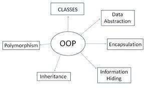

<!-- section start -->
<!-- attr: { class:'slide-title', showInPresentation:true, hasScriptWrapper:true } -->
# Defining Classes – Part 2
## Static Members, Structures,Enumerations, Generic Classes, Namespaces


<!--  -->
<!--  -->
<div class="signature">
	<p class="signature-course">C# OOP</p>
	<p class="signature-initiative">Telerik Software Academy</p>
	<a href="https://telerikacademy.com" class="signature-link">https://telerikacademy.com</a>
</div>


<!-- section start -->
<!-- attr: { showInPresentation:true, hasScriptWrapper:true } -->
# Table of Contents
- [Static Members](#static)
- [Structures in C#](#structures)
- [Generics](#generic)
- [Namespaces](#namespace)
- [Indexers](#index)
- [Operators](#operator)
- [Attributes](#attribute)


<!--  -->
<!--  -->


<!-- section start -->
<!-- attr: { class:'slide-section', showInPresentation:true, hasScriptWrapper:true } -->
<!-- # Static Members
## Static vs. Instance Members -->


<!--  -->


<!-- attr: { id:'static', showInPresentation:true, hasScriptWrapper:true } -->
# <a id="static"></a>Static Members
- Static members are associated with a type rather than with an instance
  - Defined with the modifier `static`
- Static can be used for
  - `Fields`
  - `Properties`
  - `Methods`
  - `Events`
  - `Constructors`


<!--  -->


<!-- attr: { showInPresentation:true, hasScriptWrapper:false } -->
# Static vs. Non-Static
- **Static**:
  - Associated with a type, not with an instance
- **Non-Static**:
  - The opposite, associated with an instance
- **Static**:
  - Initialized just before the type is used for the first time
- **Non-Static**:
  - Initialized when the constructor is called


<!-- attr: { showInPresentation:true, hasScriptWrapper:true } -->
# Static Members – _Example_

```cs
static class SqrtPrecalculated
{
   public const int MAX_VALUE = 10000;

   // Static field
   private static int[] sqrtValues;

   // Static constructor
   static SqrtPrecalculated()
   {
      sqrtValues = new int[MAX_VALUE + 1];
      for (int i = 0; i < sqrtValues.Length; i++)
      {
         sqrtValues[i] = (int)Math.Sqrt(i);
      }
   }
```
_(example continues)_


<!--  -->


<!-- attr: { showInPresentation:true, hasScriptWrapper:true } -->
<!-- # Static Members – _Example_ -->

```cs
   // Static method
   public static int GetSqrt(int value)
   {
      return sqrtValues[value];
   }
}

class SqrtTest
{
   static void Main()
   {
	    Console.WriteLine(
         SqrtPrecalculated.GetSqrt(254));
      // Result: 15
   }
}
```

<!--  -->


<!-- attr: { class:'slide-section demo', showInPresentation:true, hasScriptWrapper:true } -->
<!-- # Static Members
## [Demo](https://github.com/TelerikAcademy/Object-Oriented-Programming/tree/master/Topics/02.%20Defining-Classes-Part-2/demos/StaticMembers) -->


<!-- section start -->
<!-- attr: { id:'structures', class:'slide-section', showInPresentation:true, hasScriptWrapper:true } -->
<!-- # <a id="structures"></a>C# Structures -->


<!--  -->


<!-- attr: { showInPresentation:true, hasScriptWrapper:false } -->
# C# Structures
- What is a `structure` in C#?
  - A **value data type** (behaves like a primitive type)
    - _Examples_ of structures: `int`, `double`, `DateTime`
    - Classes are reference types
  - Declared by the keyword `struct`
  - Structures, like classes, have properties, methods, fields, constructors, events, …
  - **Always have a parameterless constructor**
    - It cannot be removed
  - Mostly used to store data (bunch of fields)


<!-- attr: { showInPresentation:true, hasScriptWrapper:false } -->
# C# Structures – _Example_

```cs
struct Point
{
   public int X { get; set; }
   public int Y { get; set; }
}

struct Color
{
   public byte RedValue { get; set; }
   public byte GreenValue { get; set; }
   public byte BlueValue { get; set; }
}

enum Edges { Straight, Rounded }
```

_(example continues)_


<!-- attr: { showInPresentation:true, hasScriptWrapper:false } -->
<!-- # C# Structures – _Example_ -->

```cs
struct Square
{
   public Point Location { get; set; }
   public int Size { get; set; }
   public Color SurfaceColor { get; set; }
   public Color BorderColor { get; set; }
   public Edges Edges { get; set; }
   public Square(Point location, int size,
     Color surfaceColor, Color borderColor,
     Edges edges) : this()
   {
      this.Location = location;
      this.Size = size;
      this.SurfaceColor = surfaceColor;
      this.BorderColor = borderColor;
      this.Edges = edges;
   }
}
```


<!-- attr: { class:'slide-section demo', showInPresentation:true, hasScriptWrapper:true } -->
<!-- # C# Structures
## [Demo](https://github.com/TelerikAcademy/Object-Oriented-Programming/tree/master/Topics/02.%20Defining-Classes-Part-2/demos/Structures) -->


<!--  -->


<!-- section start -->
<!-- attr: { class:'slide-section', showInPresentation:true, hasScriptWrapper:true } -->
<!-- # Generic Classes -->


<!--  -->


<!-- attr: { id:'generic', showInPresentation:true, hasScriptWrapper:true } -->
# <a id="generic"></a>What are Generics?
- **Generics** allow defining parameterized classes that process data of unknown (generic) type
  - The class can be instantiated (specialized) with different particular types
  - _Example_: <code>List&lt;T&gt; &rarr; List&lt;int&gt; / List&lt;string&gt; / List&lt;Student&gt;</code>
- Generics are also known as "**parameterized types**" or "**template types**"
  - Similar to the templates in C++
  - Similar to the generics in Java


<!-- attr: { showInPresentation:true, hasScriptWrapper:true } -->
# Generics – _Example_

```cs
public class GenericList<T>
{
  public void Add(T element) { … }
}
class GenericList_Example_
{
  static void Main()
  {
    // Declare a list of type int
    GenericList<int> intList =
      new GenericList<int>();
    // Declare a list of type string
    GenericList<string> stringList =
      new GenericList<string>();
  }
}
```

<div class="fragment balloon" style="top:15%; left:45%; width:39.89%">**T** is an unknown type, parameter of the class</div>
<div class="fragment balloon" style="top:28.07%; left:52.63%; width:39.89%">**T** can be used in any method in the class</div>
<div class="fragment balloon" style="top:50%; left:50%; width:31.75%">**T** can be replaced with **int** during the instantiation</div>


<!-- attr: { class:'slide-section demo', showInPresentation:true, hasScriptWrapper:true } -->
<!-- # Generic Classes -->


<!-- attr: { showInPresentation:true, hasScriptWrapper:false } -->
# Defining Generic Classes
- Generic class declaration:

```cs
class MyClass <type-parameter-list> : class-base
where <type-parameter-constraints-clauses>
{
  // Class body
}
```

- _Example_:


```cs
class MyClass<T> : BaseClass
where T : new()
{
  // Class body
}
```


<!-- attr: { showInPresentation:true, hasScriptWrapper:false } -->
# Generic Constraints Syntax
- Parameter constraints clause:

```cs
public SomeGenericClass<some parameters>
where type-parameter : primary-constraint,
	secondary-constraints,
	constructor-constraint
```

- _Example_:

```cs
public class MyClass<T>
where T: class, IEnumerable<T>, new()
{…}
```

<!-- attr: { showInPresentation:true, hasScriptWrapper:false } -->
# Generic Constraints
- Primary constraint:
  - `class` (reference type parameters)
  - `struct` (value type parameters)
- Secondary constraints:
  - Interface derivation
  - Base class derivation
- Constructor constraint:
  - `new()` – parameterless constructor constraint


<!-- attr: { class:'slide-section demo', showInPresentation:true, hasScriptWrapper:true } -->
<!-- # Generic Constraints
## [Demo](https://github.com/TelerikAcademy/Object-Oriented-Programming/tree/master/Topics/02.%20Defining-Classes-Part-2/demos/Generic-Constraints) -->


<!-- attr: { showInPresentation:true, hasScriptWrapper:false } -->
# Generic Method – _Example_

```cs
public static T Min<T>(T first, T second)
    where T : IComparable<T>
{
    if (first.CompareTo(second) <= 0)
       return first;
    else
       return second;
}
static void Main()
{
    int i = 5;
    int j = 7;
    int min = Min<int>(i, j);
}
```


<!-- attr: { class:'slide-section demo', showInPresentation:true, hasScriptWrapper:true } -->
<!-- # Generic Methods
## [Demo](https://github.com/TelerikAcademy/Object-Oriented-Programming/tree/master/Topics/02.%20Defining-Classes-Part-2/demos/Generic-Methods) -->


<!-- section start -->
<!-- attr: { class:'slide-section', showInPresentation:true, hasScriptWrapper:true } -->
<!-- # Namespaces -->

<!--  -->


<!-- attr: { id:'namespace', showInPresentation:true, hasScriptWrapper:false } -->
# <a id="namespace"></a>Namespaces
- `Namespaces` logically group type definitions
  - May contain classes, structures, interfaces, enumerators and other types and namespaces
  - Can not contain methods and data directly
  - Can be allocated in one or several files

<!-- attr: { showInPresentation:true, hasScriptWrapper:false } -->
<!-- # Namespaces -->
- `Namespaces` in .NET are similar to namespaces in C++ and packages in Java
- Allows definition of types with duplicated names
  - E.g. a type named **Button** is found in Windows Forms, in WPF and in ASP.NET Web Forms


<!-- attr: { showInPresentation:true, hasScriptWrapper:false } -->
# Including Namespaces
- Including a namespace
  - The `using` directive is put at the start of the file

  ```cs
  using System.Windows.Forms;
  ```

  - `using` allows direct use of all types in the namespace
  - Including is applied to the current file
  - The directive is written at the beginning of the file
  - When includes a namespace with `using` its subset of namespaces is not included


<!-- attr: { showInPresentation:true, hasScriptWrapper:false } -->
<!-- # Including Namespaces -->
- Types, placed in namespaces, can be used and without `using` directive, by their full name:

```cs
System.IO.StreamReader reader =
    System.IO.File.OpenText("file.txt");
```

- `using` can create alias for namespaces :

```cs
using IO = System.IO;
using WinForms = System.Windows.Forms;
IO.StreamReader reader =
    IO.File.OpenText("file.txt");
WinForms.Form form = new WinForms.Form();
```


<!-- attr: { showInPresentation:true, hasScriptWrapper:false } -->
# Defining Namespaces
- **Divide** the types in your applications into namespaces
  - When the types are too much (more than 15-20)
  - Group the types logically in namespaces according to their purpose
- Use **nested namespaces** when the types are too much
  - E.g. for Tetris game you may have the following namespaces: **Tetris.Core**, **Tetris.Web**, **Tetris.Win8**, **Tetris.HTML5Client**


<!-- attr: { showInPresentation:true, hasScriptWrapper:false } -->
<!-- # Defining Namespaces -->
- Distribute all public types in files identical with their names
  - E.g. the class **Student** should be in the file **Student.cs**
- Arrange the files in directories, corresponding to their namespaces
  - The directory structure from your project course-code have to reflect the structure of the defined namespaces


<!-- attr: { showInPresentation:true, hasScriptWrapper:false } -->
# Namespaces – _Example_

```cs
namespace SofiaUniversity.Data
{
    public struct Faculty
    {
        // …
    }
    public class Student
    {
        // …
    }
    public class Professor
    {
        // …
    }
    public enum Specialty
    {
        // …
    }
}
```


<!-- attr: { showInPresentation:true, hasScriptWrapper:false, style:'font-size: 40px;' } -->
<!-- # Namespaces – _Example_ -->

```cs
namespace SofiaUniversity.UI
{
    public class StudentAdminForm : System.Windows.Forms.Form
    {
        // …
    }
    public class ProfessorAdminForm : System.Windows.Forms.Form
    {
        // …
    }
}
namespace SofiaUniversity
{
    public class AdministrationSystem
    {
        public static void Main()
        {
             // …
        }
    }
}
```


<!-- attr: { showInPresentation:true, hasScriptWrapper:true } -->
<!-- # Namespaces – _Example_ -->
- Recommended directory structure and classes organization in them


<!--  -->


<!-- attr: { class:'slide-section demo', showInPresentation:true, hasScriptWrapper:true } -->
<!-- # Namespaces
## [Demo](https://github.com/TelerikAcademy/Object-Oriented-Programming/tree/master/Topics/02.%20Defining-Classes-Part-2/demos/Namespaces) -->


<!-- section start -->
<!-- attr: { class:'slide-section', showInPresentation:true, hasScriptWrapper:true } -->
<!-- # Indexers -->


<!--  -->


<!-- attr: { id:'index', showInPresentation:true, hasScriptWrapper:false, style:' font-size: 0.9em;' } -->
# <a id="index"></a>Indexers
- `Indexers` provide indexed access class data
  - Predefine the `[]` operator for certain type
    - Like when accessing array elements

```cs
IndexedType t = new IndexedType(50);
int i = t[5];
t[0] = 42;
```

  - Can accept one or multiple parameters

```cs
personInfo["Nikolay Kostov", 25]
```

  - Defining an indexer:

```cs
public int this [int index] { … }
```


<!-- attr: { showInPresentation:true, hasScriptWrapper:true} -->
# Indexers – _Example_

```cs
struct BitArray32
{
    private uint value;
    // Indexer declaration
    public int this [int index]
    {
        get
        {
            if (index >= 0 && index <= 31)
            {
                // Check the bit at position index
                if ((value & (1 << index)) == 0)
                   return 0;
                else
		     return 1;
            }
```

_(the example continues)_


<!-- attr: { showInPresentation:true, hasScriptWrapper:false, style:'font-size: 0.9em;'  } -->
<!-- # Indexers – _Example_ -->

```cs
    else
    {
        throw new IndexOutOfRangeException(
        String.Format("Index {0} is invalid!", index));
    }
}
set
{
    if (index < 0 || index > 31)
        throw new IndexOutOfRangeException(
         String.Format("Index {0} is invalid!", index));
    if (value < 0 || value > 1)
        throw new ArgumentException(
         String.Format("Value {0} is invalid!", value));       
    // Clear the bit at position index
    value &= ~((uint)(1 << index));
    // Set the bit at position index to value
    value |= (uint)(value << index);
}
```


<!-- attr: { class:'slide-section demo', showInPresentation:true, hasScriptWrapper:true } -->
<!-- # Indexers
## [Demo](https://github.com/TelerikAcademy/Object-Oriented-Programming/tree/master/Topics/02.%20Defining-Classes-Part-2/demos/Indexers) -->

<!-- section start -->
<!-- attr: { class:'slide-section', showInPresentation:true, hasScriptWrapper:true } -->
<!-- # Operators Overloading -->


<!--  -->


<!-- attr: { id:'operator', showInPresentation:true, hasScriptWrapper:false } -->
# <a id="operator"></a>Overloading Operators
- In C# some operators can be **overloaded**(**redefined**) by developers
  - The priority of operators can not be changed
  - Not all operators can be overloaded
- Overloading an operator in C#
  - Looks like a static method with 2 operands:

```cs
public static Matrix operator *(Matrix m1, Matrix m2)
{
    return new m1.Multiply(m2);
}
```


<!-- attr: { showInPresentation:true, hasScriptWrapper:false } -->
<!-- # Overloading Operators -->
- Overloading is allowed on:
  - Unary operators

```cs
+, -, !, ~, ++, --, true and false
```

- Binary  operators

```cs
+, -, *, /, %, &, |, ^, <<, >>, ==, !=, >, <, >= and <=
```

- Operators for type conversion
  - Implicit type conversion
  - Explicit type conversion `(type)`


<!-- attr: { showInPresentation:true, hasScriptWrapper:false } -->
# Overloading Operators – _Example_

```cs
public static Fraction operator -(Fraction f1,Fraction f2)
{
    long num = f1.numerator * f2.denominator -
    f2.numerator * f1.denominator;
    long denom = f1.denominator * f2.denominator;
    return new Fraction(num, denom);
}
public static Fraction operator *(Fraction f1,Fraction f2)
{
    long num = f1.numerator * f2.numerator;
    long denom = f1.denominator * f2.denominator;
    return new Fraction(num, denom);
}
```

_(the example continues)_


<!-- attr: { showInPresentation:true, hasScriptWrapper:false } -->
<!-- # Overloading Operators – _Example_ -->

```cs
// Unary minus operator
public static Fraction operator -(Fraction fraction)
{
    long num = -fraction.numerator;
    long denom = fraction.denominator;
    return new Fraction(num, denom);
}
// Operator ++ (the same for prefix and postfix form)
public static Fraction operator ++(Fraction fraction)
{
    long num = fraction.numerator + fraction.denominator;
    long denom = Frac.denominator;
    return new Fraction(num, denom);
}				
```


<!-- attr: { class:'slide-section demo', showInPresentation:true, hasScriptWrapper:true } -->
<!-- # Overloading Operators
## [Demo](https://github.com/TelerikAcademy/Object-Oriented-Programming/tree/master/Topics/02.%20Defining-Classes-Part-2/demos/Overloading-Operators) -->


<!--  -->


<!-- section start -->
<!-- attr: { class:'slide-section', showInPresentation:true, hasScriptWrapper:true } -->
<!-- # Attributes
## Applying Attributes to Code Elements -->


<!--  -->


<!-- attr: { id:'attribute', showInPresentation:true, hasScriptWrapper:false} -->
# <a id="attribute"></a>What are Attributes?
- .NET `attributes` are:
  - Declarative tags for attaching descriptive information in the declarations in the code
  - Saved in the assembly at compile time
    - Objects derived from `System.Attribute`
  - Can be accessed at runtime (through **reflection**) and manipulated by many tools
- Developers can define custom attributes


<!-- attr: { showInPresentation:true, hasScriptWrapper:false, style:'font-size:0.9em'  } -->
# Applying Attributes – _Example_
- Attribute\`s name is surrounded by square brackets `[]`
  - Placed before their target declaration

  ```cs
  [Flags] // System.FlagsAttribute
  public enum FileAccess
  {
      Read = 1,
      Write = 2,
      ReadWrite = Read | Write
  }
  ```

- `[Flags]` attribute indicates that the enum type can be treated like a set of bit flags


<!-- attr: { showInPresentation:true, hasScriptWrapper:true, style:'font-size:0.9em'  } -->
<!-- # Attributes with Parameters -->
- Attributes can accept parameters for their constructors and public properties

```cs
[DllImport("user32.dll", EntryPoint="MessageBox")]
public static extern int ShowMessageBox(int hWnd,
    string text, string caption, int type);
…
ShowMessageBox(0, "Some text", "Some caption", 0);
```

- The `[DllImport]` attribute refers to:
  - `System.Runtime.InteropServices.DllImportAttribute`
  - "**user32.dll**" is passed to the constructor
  - "**MessageBox**" value is assigned to **EntryPoint**


<!-- attr: { showInPresentation:true, hasScriptWrapper:false } -->
# Set a Target to an Attribute
- Attributes can specify its target declaration:

```cs
// target "assembly"
[assembly: AssemblyTitle("Attributes Demo")]
[assembly: AssemblyCompany("DemoSoft")]
[assembly: AssemblyProduct("Entreprise Demo Suite")]
[assembly: AssemblyVersion("2.0.1.37")]
[Serializable] // [type: Serializable]
class TestClass
{
    [NonSerialized] // [field: NonSerialized]
    private int status;
}
```

  - See the **Properties/AssemblyInfo.cs** file


<!-- attr: { class:'slide-section demo', showInPresentation:true, hasScriptWrapper:true } -->
<!-- # Using Attributes
## [Demo](https://github.com/TelerikAcademy/Object-Oriented-Programming/tree/master/Topics/02.%20Defining-Classes-Part-2/demos/Attributes) -->


<!-- attr: { showInPresentation:true, hasScriptWrapper:false } -->
# Custom Attributes
- .NET developers can define their own **custom attributes**
  - Must inherit from `System.Attribute` class
  - Their names must end with '`Attribute`'
  - Possible targets must be defined via `[AttributeUsage]`
  - Can define constructors with parameters
  - Can define public fields and properties


<!-- attr: { showInPresentation:true, hasScriptWrapper:false } -->
# Custom Attributes – _Example_

```cs
[AttributeUsage(AttributeTargets.Struct |
  AttributeTargets.Class | AttributeTargets.Interface,
  AllowMultiple = true)]
public class AuthorAttribute : System.Attribute
{
  public string Name { get; private set; }

  public AuthorAttribute(string name)
  {
    this.Name = name;
  }
}

```

_(example continues)_


<!-- attr: { showInPresentation:true, hasScriptWrapper:false } -->
<!-- # Custom Attributes –_Example_ -->

```cs
[Author("Doncho Minkov")]
[Author("Nikolay Kostov")]
class CustomAttributesDemo
{
  static void Main(string[] args)
  {
    Type type = typeof(CustomAttributesDemo);
    object[] allAttributes =
      type.GetCustomAttributes(false);
    foreach (AuthorAttribute attr in allAttributes)
    {
      Console.WriteLine(
        "This class is written by {0}. ", attr.Name);
    }
  }
}
```

<!-- attr: { class:'slide-section', showInPresentation:true, hasScriptWrapper:true } -->
<!-- # Defining, Applying and Retrieving Custom Attributes
## [Demo](https://github.com/TelerikAcademy/Object-Oriented-Programming/tree/master/Topics/02.%20Defining-Classes-Part-2/demos/Custom-Attributes) -->


<!-- attr: { showInPresentation:true, hasScriptWrapper:false, style:'font-size: 40px;' } -->
# Summary
- **Classes** define specific structure for **objects**
  - **Objects** are particular instances of a **class**
- **Constructors** are invoked when creating **new class** instances
- **Properties** expose the **class data** in safe, controlled way
- **Static** members are **shared** between all instances
  - **Instance** members are **per object**
- **Structures** are "value-type" classes
- **Generics** are parameterized classes


<!-- attr: { class:'slide-section', showInPresentation:true, hasScriptWrapper:false } -->
<!-- # Defining Classes – Part 2
## Questions? -->


<!-- attr: { showInPresentation:true, hasScriptWrapper:true } -->
# Free Trainings @ Telerik Academy
- C# Programming @ Telerik Academy
    - [C# OOP Course](http://academy.telerik.com/student-courses/programming/object-oriented-programming/about)
  - Telerik Software Academy
    - [telerikacademy.com](https://telerikacademy.com)
  - Telerik Academy @ Facebook
    - [facebook.com/TelerikAcademy](facebook.com/TelerikAcademy)
  - Telerik Software Academy Forums
    - [forums.academy.telerik.com](forums.academy.telerik.com)


<!--  -->
<!--  -->
<!--  -->
<!--  -->
