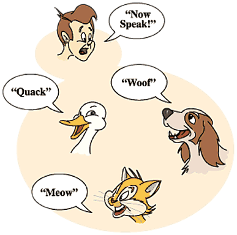
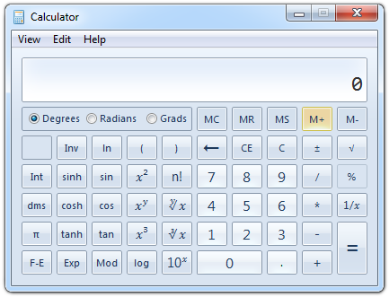
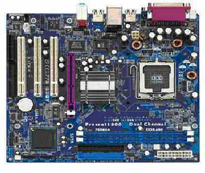

<!-- section start -->
<!-- attr: { class:'slide-title', showInPresentation:true, hasScriptWrapper:true } -->
# Object-Oriented Programming Fundamental Principles – Part 2
## Polymorphism, Class Hierarchies, Exceptions, Strong Cohesion and Loose Coupling

<!--  -->
<!--  -->
<div class="signature">
	<p class="signature-course">C# OOP</p>
	<p class="signature-initiative">Telerik Software Academy</p>
	<a href="https://telerikacademy.com" class="signature-link">https://telerikacademy.com</a>
</div>


<!-- section start -->
<!-- attr: { showInPresentation:true, hasScriptWrapper:true } -->
# Contents
- [Polymorphism](#polymorph)
- [Class Hierarchies: Real World Example](#hierarchies)
- [Exception Handling and Exception Classes](#exception)
- [Cohesion and Coupling](#cohesion)


<!--  -->
<!--  -->


<!-- section start -->
<!-- attr: { class:'slide-section', showInPresentation:true, hasScriptWrapper:true } -->
<!-- # Polymorphism -->


<!--  -->


<!-- attr: { id:'polymorph', showInPresentation:true, hasScriptWrapper:false } -->
# <a id="polymorph"></a> Polymorphism
- **Polymorphism** = ability to **take more than one form**(objects have more than one type)
  - A class can be used through its parent interface
  - A child class may override some of the behaviors of the parent class
- Polymorphism allows **abstract operations** to be defined and invoked
  - Abstract operations are defined in the base class' interface and implemented in the child classes
    - Declared as `abstract` or `virtual`


<!-- attr: { showInPresentation:true, hasScriptWrapper:true } -->
<!-- # Polymorphism -->
- Why handle an object of given type as object of its base type?
  - To invoke **abstract operations**
  - To mix different related types in the same collection
    - E.g. <code>List &lt;object&gt;</code> can hold anything
  - To pass more specific object to a method that expects a parameter of a more generic type
  - To declare a more generic field which will be initialized and "specialized" later


<!-- attr: { showInPresentation:true, hasScriptWrapper:false, style:'font-size:40px;' } -->
# Virtual Methods
- `Virtual method` is
  - Defined in a base class and can be **changed** (overridden) in the descendant classes
  - Can be called through the base class' interface
- Virtual methods are declared through the keyword `virtual`

```cs
public virtual void Draw() { … }
```

- Methods declared as virtual in a base class can be overridden using the keyword `override`

```cs
public override void Draw() { … }
```


<!-- attr: { class:'slide-section demo', showInPresentation:true, hasScriptWrapper:true } -->
<!-- # Virtual Methods
## [Demo](https://github.com/TelerikAcademy/Object-Oriented-Programming/tree/master/Topics/05.%20OOP-Principles-Part-2/demos/Virtual-Methods) -->


<!--  -->


<!-- attr: { showInPresentation:true, hasScriptWrapper:false } -->
# More about Virtual Methods
- `Abstract methods` are purely virtual
  - If a method is `abstract` &rarr; it is `virtual` as well
  - Abstract methods are designed to be changed (overridden) later
- **Interface members** are also purely virtual
  - They have no default implementation and are designed to be overridden in a descendent class
- Virtual methods can be **hidden** through the new keyword:

```cs
public new double CalculateSurface() { return … }
```


<!-- attr: { showInPresentation:true, hasScriptWrapper:false } -->
# The override Modifier
- Using `override` we can modify a method or property
  - An override method provides a **replacement implementation** of an inherited member
  - You cannot override a non-virtual or static method
- The overridden base method must be `virtual`, `abstract`, or `override`


<!-- attr: { showInPresentation:true, hasScriptWrapper:true} -->
# How it works?
- **Polymorphism** ensures that the appropriate method of the subclass is called through its base class' interface
- Polymorphism is implemented using a technique called **late method binding**
  - The exact method to be called is determined at **runtime**, just before performing the call
  - Applied for all `abstract`/`virtual` methods
- _Note_: Late binding is a bit slower than normal (early) binding


<!-- attr: { showInPresentation:true, hasScriptWrapper:true} -->
<!-- # Polymorphism – _Example_ -->
<!--  -->

<!-- attr: { showInPresentation:true, hasScriptWrapper:false } -->
# Polymorphism – _Example_
```cs
public abstract class Figure {
  public abstract double CalcSurface();
}
public class Square : Figure {
  public override double CalcSurface() { return … }
}
public class Circle : Figure {
  public override double CalcSurface() { return … }
}
Figure f1 = new Square(...);
Figure f2 = new Circle(...);
// This will call Square.CalcSurface()
int surface = f1.CalcSurface();
// This will call Circle.CalcSurface()
int surface = f2.CalcSurface();
```

<!-- attr: { class:'slide-section demo', showInPresentation:true, hasScriptWrapper:true } -->
<!-- # Polymorphism
## [Demo](https://github.com/TelerikAcademy/Object-Oriented-Programming/tree/master/Topics/05.%20OOP-Principles-Part-2/demos/Polymorphism) -->
<!--  -->

<!-- section start -->
<!-- attr: { class:'slide-section', showInPresentation:true, hasScriptWrapper:true } -->
<!-- # Class Hierarchies:<br />  Real World _Example_ -->


<!--  -->


<!-- attr: { id:'hierarchies', showInPresentation:true, hasScriptWrapper:true } -->
# <a id="hierarchies"></a>_Example_: Calculator
- Creating an application like the Windows Calculator
  - Typical scenario for applying the object-oriented approach


<!--  -->


<!-- attr: { showInPresentation:true, hasScriptWrapper:false } -->
<!-- # _Example_: Calculator -->
- The calculator consists of controls:
  - Buttons, panels, text boxes, menus, check boxes, radio buttons, etc.
- Class `Control` – the root of our OO hierarchy
  - All controls can be painted on the screen
    - Should implement an interface `IPaintable` with a method `Paint()`
  - Common properties: location, size, text, face color, font, background color, etc.


<!-- attr: { showInPresentation:true, hasScriptWrapper:false } -->
<!-- # _Example_: Calculator -->
- Some controls could contain other (nested) controls inside (e. g. panels and toolbars)
  - We should have class `Container` that extends `Control` holding a collection of child controls
- The `Calculator` itself is a `Form`
  - `Form` is a special kind of `Container`
  - Contains also border, title (`text` derived from `Control`), icon and system buttons
- How the `Calculator` paints itself?
  - Invokes `Paint()` for all child controls inside of him


<!-- attr: { showInPresentation:true, hasScriptWrapper:false } -->
<!-- #  _Example_: Calculator -->
- How a `Container` paints itself?
  - Invokes `Paint()` for all controls inside it
  - Each control knows how to visualize itself
- What is the common between buttons, check boxes and radio buttons?
  - Can be pressed
  - Can be selected
- We can define class `AbstractButton` and all buttons can derive from it

<!-- attr: { showInPresentation:true, hasScriptWrapper:true } -->
<!-- # Calculator Classes -->
<!--  -->


<!-- section start -->
<!-- attr: { class:'slide-section', showInPresentation:true, hasScriptWrapper:true } -->
<!-- # Exception Classes
## User-Defined Exception Classes -->


<!--  -->


<!-- attr: { id:'exception', showInPresentation:true, hasScriptWrapper:false } -->
# <a id="exception"></a>Exception Handling in OOP
- In OOP `exception handling` is the main paradigm for error handling
  - `Exceptions` are special classes that hold information about an error or unusual situation
- Exceptions are thrown (raised) through the `throw` keyword

```cs
throw new InvalidCalculationException(
  "Cannot calculate the size of the specified object");
```

- Exceptions are handled though the `try-catch-finally` and `using(…)` constructs


<!-- attr: { showInPresentation:true, hasScriptWrapper:true } -->
# Exception Hierarchy
- Exceptions in .NET Framework are organized in a object-oriented **class hierarchy**


<!--  -->


<!-- attr: { showInPresentation:true, hasScriptWrapper:false } -->
# Defining an Exception Class
- To define an exception class, inherit from `ApplicationException` and define constructors

```cs
using System;

public class InvalidCalculationException
  : ApplicationException
{
  public InvalidCalculationException(string msg)
    : base(msg)
  { }

  public InvalidCalculationException(string msg,
    Exception innerEx) : base(msg, innerEx)
  { }
}
```

<!-- attr: { class:'slide-section demo', showInPresentation:true, hasScriptWrapper:true } -->
<!-- # Defining Exception Classes
## [Demo](https://github.com/TelerikAcademy/Object-Oriented-Programming/tree/master/Topics/05.%20OOP-Principles-Part-2/demos/User-Defined-Exception) -->


<!--  -->

<!-- section start -->
<!-- attr: { class:'slide-section', showInPresentation:true, hasScriptWrapper:true } -->
<!-- # Cohesion and Coupling -->

<!--  -->


<!-- attr: { id:'cohesion', showInPresentation:true, hasScriptWrapper:false } -->
# <a id="cohesion"></a> Cohesion
- **Cohesion** describes
  - How closely the routines in a class or the code in a routine support a **central purpose**
- Cohesion must be **strong**
  - Well-defined abstractions keep cohesion strong
- Classes must contain **strongly related functionality** and aim for single purpose
- Cohesion is a powerful tool for managing complexity


<!-- attr: { showInPresentation:true, hasScriptWrapper:true } -->
# Good and Bad Cohesion
- **Good cohesion**: HDD, CR-ROM, remote control


<br />
<br />
<br />
- **Bad cohesion**: spaghetti code, single-board computer


<!-- attr: { showInPresentation:true, hasScriptWrapper:true } -->
# Strong Cohesion
- **Strong cohesion** (good cohesion) example
  - Class `Math` that has methods:
    - `Sin()`, `Cos()`, `Asin()`
    - `Sqrt()`, `Pow()`, `Exp()`
    - `Math.PI`, `Math.E`

```cs
double sideA = 40, sideB = 69;
double angleAB = Math.PI / 3;

double sideC =
    Math.Pow(sideA, 2) + Math.Pow(sideB, 2)
    - 2 * sideA * sideB * Math.Cos(angleAB);

double sidesSqrtSum = Math.Sqrt(sideA) + Math.Sqrt(sideB)
 + Math.Sqrt(sideC);
```


<!--  -->


<!-- attr: { showInPresentation:true, hasScriptWrapper:false } -->
# Weak Cohesion
- **Weak cohesion** (bad cohesion) example
  -  Class **Magic** that has these methods:

```cs
public void PrintDocument(Document d);
public void SendEmail(
string recipient, string subject, string text);
public void CalculateDistanceBetweenPoints(
int x1, int y1, int x2, int y2)
```

- Another example:

```cs
MagicClass.MakePizza("Fat Pepperoni");
MagicClass.WithdrawMoney("999e6");
MagicClass.OpenDBConnection();
```


<!-- attr: { showInPresentation:true, hasScriptWrapper:false } -->
# Coupling
- **Coupling** describes how tightly a class or routine is related to other classes or routines
- Coupling must be kept **loose**
  - Modules must depend little on each other
    - Or be entirely independent (**loosely coupled**)
  - All classes / routines must have small, direct, visible, and flexible relationships to other classes / routines
  - One module must be easily used by other modules


<!-- attr: { showInPresentation:true, hasScriptWrapper:true } -->
# Loose and Tight Coupling
- **Loose Coupling**:
  - Easily replace old HDD
  - Easily place this HDD  
	to another motherboard


- **Tight Coupling**:
  - Where is the video adapter?
  - Can you change the video controller?




<!-- attr: { showInPresentation:true, hasScriptWrapper:false } -->
# Loose Coupling – _Example_

```cs
class Report
{
    public bool LoadFromFile(string fileName) {…}
    public bool SaveToFile(string fileName) {…}
}
class Printer
{
    public static int Print(Report report) {…}
}
class Program
{    
    static void Main()
    {
        Report myReport = new Report();          
        myReport.LoadFromFile("C:\\DailyReport.rep");
        Printer.Print(myReport);
    }
}
```


<!-- attr: { showInPresentation:true, hasScriptWrapper:false, style:'font-size: 40px;' } -->
# Tight Coupling – _Example_

```cs
class MathParams
{
    public static double operand;
    public static double result;
}
class MathUtil
{
    public static void Sqrt()
    {
      MathParams.result = CalcSqrt(MathParams.operand);
    }
}   
class MainClass
{
    static void Main()
    {
        MathParams.operand = 64;
        MathUtil.Sqrt();
        Console.WriteLine(MathParams.result);
    }
}
```


<!-- attr: { showInPresentation:true, hasScriptWrapper:false } -->
# Spaghetti Code
- Combination of bad cohesion and tight coupling:

```cs
class Report
{
  public void Print() {…}
  public void InitPrinter() {…}
  public void LoadPrinterDriver(string fileName) {…}
  public bool SaveReport(string fileName) {…}
  public void SetPrinter(string printer) {…}
}
class Printer
{
  public void SetFileName() {…}
  public static bool LoadReport() {…}
  public static bool CheckReport() {…}
}
```


<!-- attr: { showInPresentation:true, hasScriptWrapper:false, style:'font-size: 40px;' } -->
# Summary
- OOP fundamental principals are: **inheritance**, **encapsulation**, **abstraction**, **polymorphism**
  - Inheritance allows inheriting members from another class
  - Abstraction and encapsulation hide internal data and allow working through abstract interface
  - Polymorphism allows working with objects through their parent interface and invoke abstract actions
- Exception classes are natural to OOP
- **Strong cohesion** and **loose coupling** avoid spaghetti code


<!-- attr: { class:'slide-section', showInPresentation:true, hasScriptWrapper:false } -->
<!-- # Object-Oriented Programming Fundamental Principles – Part 2
## Questions? -->


<!-- attr: { showInPresentation:true, hasScriptWrapper:true } -->
# Free Trainings @ Telerik Academy
- C# Programming @ Telerik Academy
    - [C# OOP Course](http://academy.telerik.com/student-courses/programming/object-oriented-programming/about)
  - Telerik Software Academy
    - [telerikacademy.com](https://telerikacademy.com)
  - Telerik Academy @ Facebook
    - [facebook.com/TelerikAcademy](facebook.com/TelerikAcademy)
  - Telerik Software Academy Forums
    - [forums.academy.telerik.com](forums.academy.telerik.com)


<!--  -->
<!--  -->
<!--  -->
<!--  -->
